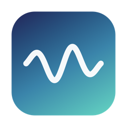
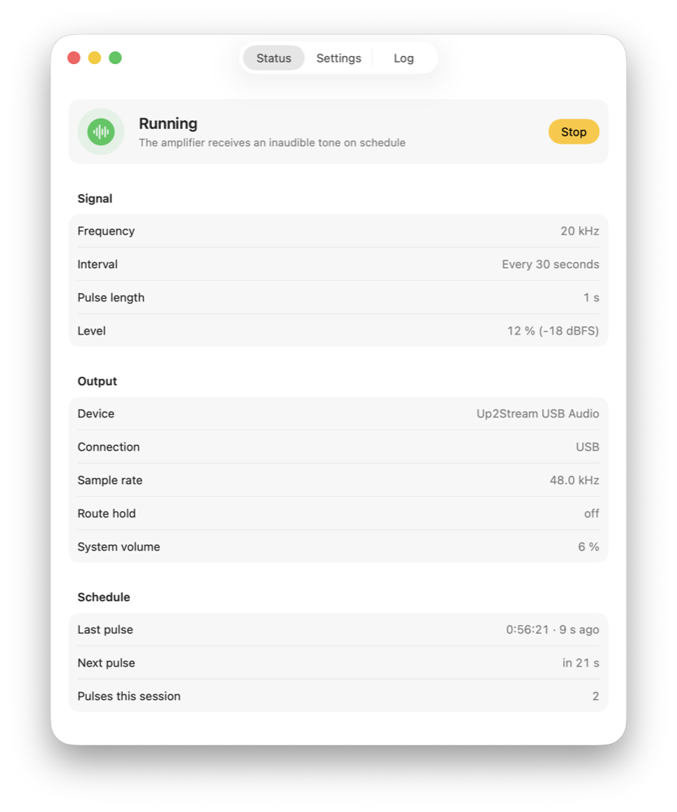
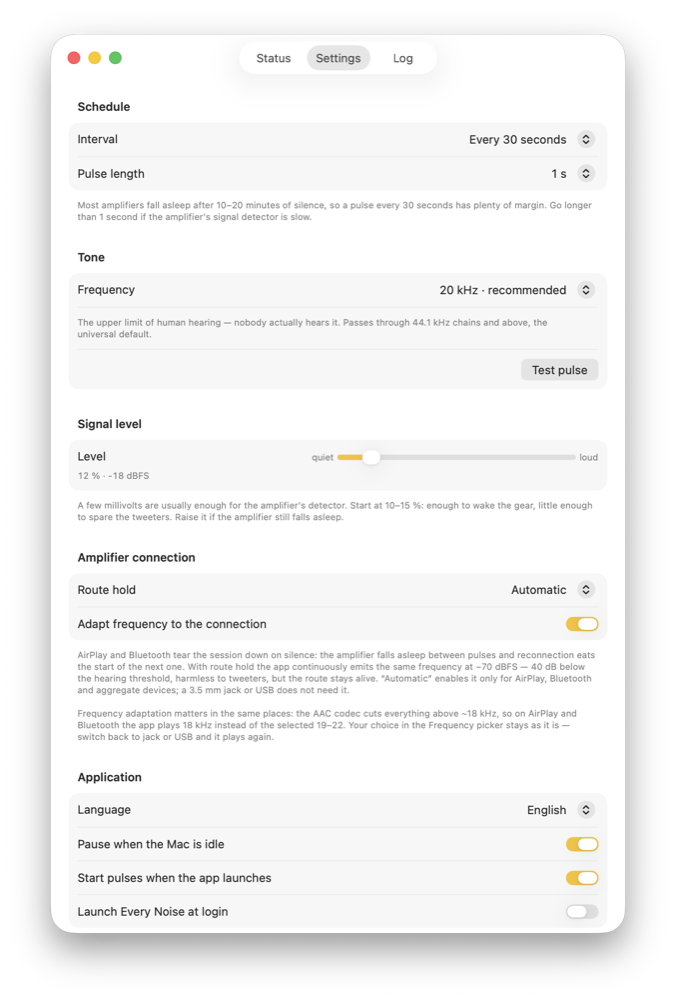
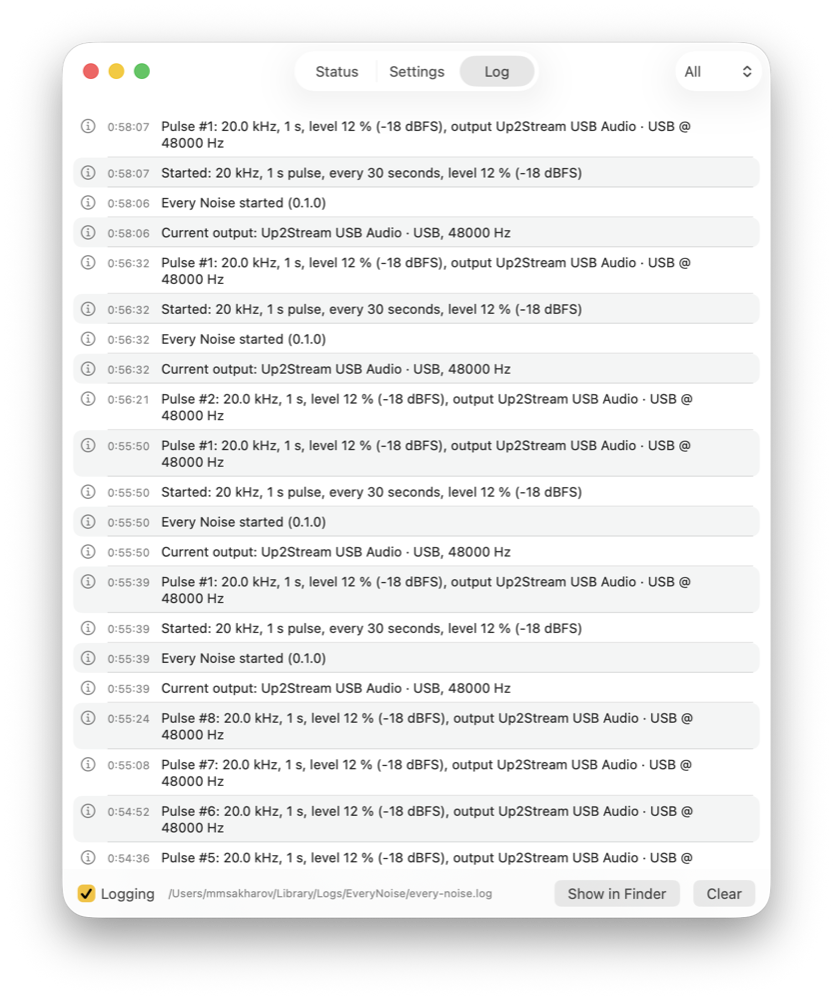

# Every Noise

<p align="center">
  
</p>

A macOS menu bar app that keeps your amplifier awake. Amplifiers with auto-standby switch
off after 10–20 minutes of silence and take a moment to come back, swallowing the start of
a track or the first words of a call. Every Noise plays a short tone beyond the range of
hearing at a set interval: you don't hear it, the amplifier's signal detector does.

<p align="center">
  
</p>

## Installation

Download `EveryNoise-<version>.zip` from
[Releases](https://github.com/sakharovmaksim/every-noise/releases) and move
`Every Noise.app` to `/Applications`. The build is ad-hoc signed, so clear the quarantine
flag:

```bash
xattr -dr com.apple.quarantine "/Applications/Every Noise.app"
open -a "Every Noise"
```

Or open it once via right-click → **Open** → **Open**.

The icon appears in the menu bar; the window opens from **Open Every Noise**. Launch at
login only works for an app that lives in `/Applications`.

## Using it

The defaults — **20 kHz, 1 s pulse, every 30 seconds** — suit most systems. The app detects
the connection type and adapts the frequency to it: on AirPlay and Bluetooth it plays
18 kHz, because the AAC codec cuts everything above that, while on jack, USB and HDMI it
plays what you picked.

If the amplifier still falls asleep, in this order:

1. Check that audio is not muted and the volume is not at zero — the Status tab warns you.
2. Raise the pulse length to 2–3 s: a single second is not enough for slow detectors.
3. Raise the level to 25–40 %.
4. Step down in frequency: 19 → 18 → 17 kHz.

The **Test pulse** button under the frequency picker plays a pulse right away instead of
waiting for the schedule, which makes tuning much faster.

If none of that helps, the amplifier's detector does not see high frequencies — try the
20 Hz preset at no more than 10 % level.

<p align="center">
  
</p>

## About the frequency

The upper limit of human hearing is around 20 kHz, and it drops with age: by 25 it is
usually 17–18 kHz. That is why virtually nobody hears the default 20 kHz, while teenagers
and children hear the 17–18 kHz presets clearly — reach for those only when you have to.

Dogs hear up to about 45 kHz and cats up to 64 kHz, so every ultrasonic preset is audible
to them. If your pets react, switch to 10–20 Hz.

## What the app handles on its own

- Follows output device changes, including the speakers ↔ 3.5 mm jack switch, and rebuilds
  the audio chain.
- Caps the frequency at what the current chain can carry, so the tone does not disappear in
  the DAC filter.
- Holds the route on AirPlay and Bluetooth with a near-silent carrier; otherwise the session
  drops on silence and the beginning of the next pulse is lost.
- Does not keep your Mac awake: pulses stop after 5 minutes of inactivity and when the Mac
  goes to sleep, and resume when you come back.
- Refuses to start a second copy.

The interface is available in English and Russian, switchable in Settings without a
restart. On first launch it follows the system language.

## Log

`~/Library/Logs/EveryNoise/every-noise.log`, rotated at 512 KB, 5 generations kept. The Log
tab shows the last 500 entries, filters them by level and reveals the file in Finder; the
**Logging** checkbox at the bottom stops recording.

<p align="center">
  
</p>

## More

- [README-features.md](README-features.md) — a detailed tour of what the app can do.
- [README-developer.md](README-developer.md) — building from source and publishing releases.

Swift 6 + SwiftUI, macOS 15 and later. Local build: `make release`, no Xcode required.

## License

MIT, see [LICENSE](LICENSE).
